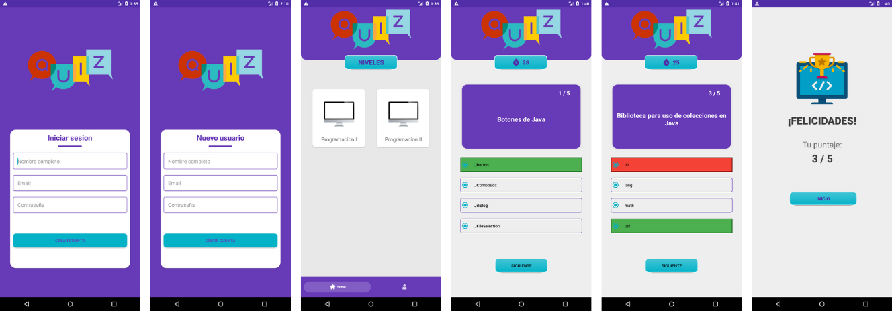

# App Quiz

App programmed in Java using Android Studio, currently in development with 6 functional screens:

Login: User authentication through Firebase.
Sign up: Registration of a new user using Firebase.
Main: Displays levels/categories of existing quizzes.
Quiz: Extraction of questions and options using SQLite and queries, with a time limit and immediate feedback on the selected option.
Results: At the end, it shows the total number of questions answered correctly.
